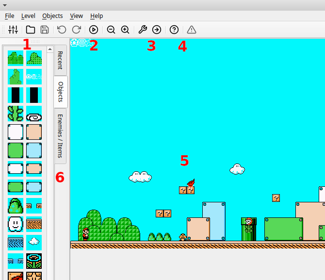
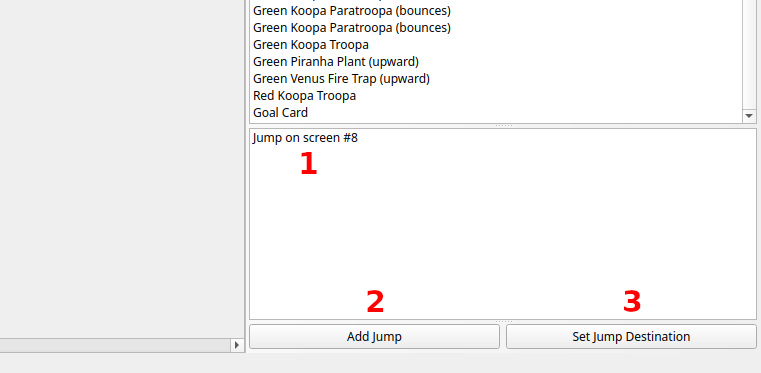
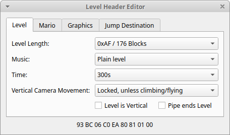
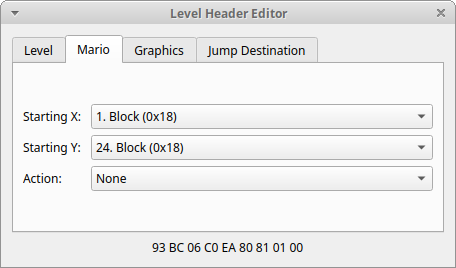
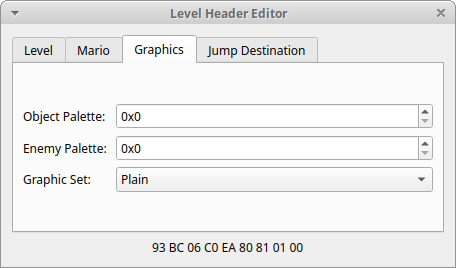
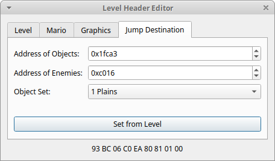

# SMB3 Foundry - Level Editor

## Level Selector

### 1 - Level Data Section

A Level in SMB3 is made up of 3 things: Enemy/Item data, which contains all Goombas, Koopas and special items, that
change how the level works, Object Data, which contains all the platforms, pipes and coin blocks in the level, and an
Object Set, which determines, which Objects you have access to.

Because of memory constraints of the old hardware SMB3 was made to run on, you don't always have access to all Objects
at the same time, so they were bundled together by theme. Things like coin blocks and platforms are always part of all
Object Sets. Enemies and Items can always be used, independent of the Object Set.

This means, that, in order to load a Level from the Rom into the Editor, we need to provide the address of the Object
Data, the address of the Enemy/Item Data and the Object Set, which the Level is supposed to be, so that we can parse
the Object Data correctly.

The addresses are shown in Hexadecimal Notation. This is for historical reasons and a quick google search will get you
up to speed.

Unless you know specifically where in the Rom you have placed your game, you won't need to set these manually, however.

### 2 - World selection

Another way to select a Level is from a list of stock levels, or directly from the World Map inside the Rom.

The first tab gives you a list of all levels in the Vanilla SMB3 Rom, even some, that are inaccessible
in the game, or have never been finished by the developers. If you start with a fresh copy of SMB3, those are all there
for you to see and edit as much as you like. But as you start making changes and maybe changing the size of some levels
you'll probably overwrite some or all of these, so see them as a starting off point.

In the other tabs are the 9 Worlds SMB3 has to offer. They are rendered as they are found in the Rom, so if you made
changes to some of these Overworlds, using Scribe, for example, then those will be shown here, too.

Some Overworlds might be too big to fit into the screen completely, so use the horizontal scroll bar, that will appear
in those situations to get to where you want to be.

### 3 - Overworld Screen

If you move your cursor over the map, it will change into a pointing hand, when it has found a level pointer at that
position. If you hold it there, a tooltip with a little preview of the level will appear, so that you don't have to open
it to remember which level you put there. Clicking it once, will fill in the Level Information of that level into the
Level Data Section below, clicking it again, or double-clicking any level will load it immediately.

Note that there are many more levels, that just the standard 1-10s, since every tile a Sprite (like a Hammer Bro) can
go to needs its own level. Which means you can make different Hammer Bro levels, depending on where Mario collides with
him.

## Level Editor - Upper Left

### 1 - Toolbar: Editor Settings and Rom Operations

On the left of the Toolbar are the button for the Editor Settings, which will be explained later, a button to open a
new Rom and the save button. If it is disabled, then no changes have been made, or all changes have been undone.

### 2 - Undo, Instaplay and Zoom Controls

Further there are buttons to undo and redo any changes you made. There should be no changes you can do to the level, its
properties or the Rom, that cannot be undone, except for saving the Rom of course. If there is, then that's a bug and
should be fixed, since it could interfere with other things being undone and redone.

Next to them there is the Instaplay button. If you have set a path to an emulator on your computer in the editor settings
and you press this button, the editor will make a copy of your Rom and place
the level as it currently is to the Level-1 tile of the world the level belongs to. We can know the World of a level, if
it was opened from a World Map in the Level Selector, or if it was opened from an M3L file, which had a world number set.
If no world is known, World-1 is used.

If your world map has no Level-1 tile anywhere, please put one in for the time of
development. It's hard to know where to put a level, while keeping the world intact as you intend, so using the Level-1
tile as a shortcut for an easily accessible level is the best solution currently.

I repeat, this does not save your Level to your Rom and does not change *your* Rom in any way, making this a quick and
convenient way to test your levels quickly.

Finally there are two zoom buttons, that let you zoom in and out of your level to see more or less of it in one go.

### 3 - Level Header and Jump Destination

There are a lot of properties a level has, that are defined in the first 9 Bytes of the Object Data. To give you easy
access to those, they are grouped in the Level Header Editor, which you can access through this button. More on that
later.

On of the properties defined in the Level Header is the Jump Destination of the Level. Every Level can declare one other
Level that Pipes, Doors or other special Objects will transport the player.

Pressing this button will take you to this Level, since most of the time, those levels are bonus areas and not accessible
from the Overworld. So if you want to edit your Bonus Sub-Level of your version of 1-1, select that one first and then
go to the Jump Destination with this button.

### 4 - What's this? and Warnings

The left Button with the question mark enables "What's this?" mode, which lets you click areas in the editor to get an
explanation on what they are and what they do. It is analogous to a manual, if you don't want to read the manual. Try
to find all the things you can click in this mode!

On the right is the Warning List. In the screenshot above, there are no warnings, which is why the icon is greyed out.
Should you do something in the level, which would crash the game or would not work as you might expect, for example some
enemies cannot be on the screen at the same time, then this icon will be activated and, when clicked, show you a list of
all problems (that are currently detected) and, when you hover over one of them, will show you which objects are involved,
if any. You can of course ignore the Warnings and see if you get away with it, using instaplay.

### 5 - Level View

This is the main event and shows you the Level as it would be rendered in game, plus some amenities on top, which you
can toggle on or off in the View Menu up at the top, more on that later.

In here you can move objects around, resize them, if possible, copy/paste them all around. There's not much more to it,
but that simplicity and ease of use lets you concentrate on creating, without worrying about, how it is encoded as bytes
and bits in the background.

While the LevelView is very good at rendering the Level as the Rom would do, it uses its own code to do so, so some
colors or niche objects might render one block off, or different entirely. If you find one of those, please consider
sending a M3L file of a Level with that object and sending it in as an issue on the GitHub page or on discord, so I can
fix it.

### 6 - The Object Toolbar

On the left you find previews of all Enemies/Items and Objects in the Object Set of the Level. You can either drag and
drop them into the level or click on them to select them and add them via middle-click on your mouse.

The Objects you can resize are shown in their smallest form, that makes sense, so remember to try and see, if you can
resize them after dropping them in the Level. If you are unsure what a certain Object or Enemy is supposed to be, hover
over them to get a Tooltip with its full name.

Objects, that you added to the level will also be added to the Recent Tab, so if you find yourself using the same 3
Objects repeatedly, you might like using it more than re-selecting them all the time.

## Level Editor - Upper Right

### 1 - Object Byte Information

An Object or Enemy/Item in SMB3 is defined by its Bank/Domain, its Index within that Domain and optionally its Length.
This is Information, that is largely irrelevant, if you don't want to dive deeper into how the Rom stores Levels, but
since this was how Objects used to be edited, by remembering their Domain and Index and setting it manually, I decided
to keep it in, as an homage, and to make the transition easier for people using older Editors for years.

It's also cool to have this information visible somewhere, since there's no reason to hide it away from Users.

### 2 - The Object Dropdown

This is an alternative way to select an Object and add it into the Level. If you know what an object is called and don't
want to go through the Object Toolbar to find it, you can simply type it into the Dropdown, or scroll through the names
and little previews, to find it.

Simply use your middle mouse button to add the Object or Enemy after selecting it that way.

### 3 - The Size Bars

Object and Enemy Data of Levels are stored with others of their type and Object Set on after another. This is ok, as
long as your edited Level is smaller than or the same size as the original. But if you add more Objects (in terms of
their combined size in bytes), you risk overwriting the Level, that is stored right after the current one.

The Editor will warn you, when you go to save the Level and you can still go ahead, if you so choose, but to give you a
visual indication on where you are size-wise, these two bars show you the size of both the Objects and Enemies/Items,
when you loaded the Level on the right and the current sizes on the left. Should you be over with one of them, the bars
will turn red.

### 4 - The Palette Editor

Levels have a Level Palette, which dictates what colors are used to draw the Objects in a Level. There is also an Enemy
Palette, but since we do not render Enemies according to their palette, it is not editable at the moment.

A palette has 4 sets of 4 colors, as seen here, laid out horizontally. The first color is the background color and is
always the same across the 4 sets. The others can be chosen freely from the color palette the NES was capable of
displaying.

If you double-click on one of the colors, you will be able to choose a replacement. Be careful though! There is a limited
number of color palettes and all Levels share these, so if you change one, you change them for all Levels that use it.

Also, since different emulators display the color range of the NES differently, you might want to double-check how the
new color combination looks, using the Instaplay button.

### 5 - The Object List

This is a list of all Objects and Enemies/Items in the level in the order, that they are/would be stored in the Rom.
This might also determine which blocks are rendered in the foreground. You can't change the order using this list,
because in most cases it shouldn't be necessary. If you do find yourself with a block that is not in the foreground,
like it should be, you can right-click on it, to get it into the fore- or background, instead.

You can however select Objects or Enemies in the Level and hit Delete, to remove them from the Level.

Since Objects and Enemies/Items are stored separately in the Rom, the first Enemy is always listed after the last Object.

## Level Editor - Lower Right

### 1 - Jump List

As alluded to above, every Level can define *one* other Level its Pipes and Doors will jump to. But, by defining different
Jumps, you can have different Doors lead to different Areas in that other level.

Levels are made up of 16 Block wide screens, and you can have a different Jump for each screen, if you want. More on
what you can do with those, will be explained later with the Jump Editor.

If you want to edit any of the Jumps in the Level, simply double-click on one, or right-click and select Edit Jump.

### 2 - Add Jump Button

With this you add a new Jump to the Level. A Jump counts as an Object, but are not shown in the Object List, because it
made more sense to show them separately, since they are not rendered on screen and work completely different from other
Objects.

### 3 - Set Jump Destination

This lets you set the Jump Destination of the current Level. You can also do this in the Level Header Editor, but it felt
like putting a shortcut to it here made sense. And this way the Add Jump Button won't feel so alone.

## Jump Editor

## Level Position

As discussed, a Jump is valid for one screen (and technically for all following screens, that don't have a Jump set
themselves). If you have trouble visualizing where each screen is, you can turn on a Grid and the Jump Zones in the View
Menu.

Any Pipe, or Door, which can be entered and is placed within that Jump Zone, will lead to the Jump Destination, with
the exit options of this Jump.

You cannot have multiple Jumps on the same Screen. They will probably just overwrite each other.

## Exit Options

This should probably be called Entry options, because they define where and how Mario will enter the Jump Destination,
but since he will mostly be exiting a Pipe or a Door, it kinda makes sense as well.

The first is the Exit Action and should probably match how he exits the current Level, Door to Door, Pipe to Pipe, you're
sharp, you get it. A bunch of them are undefined, so you should probably not use them.

The x coordinate of Mario can be chosen down to the Block, but the y coordinate is a bit more limited. Since multiple
Levels can have the same Jump Destination, or often one Level has multiple Jumps to different parts of the same Level,
unfortunately we can't render that in the Level View, if you go to the Jump Destination of a Level. You'll have to remember
where you put Mario, for each Jump.

## Editor Settings

### 1 - Mouse Settings

This lets you change how your mouse interacts with the Objects and Enemies/Items in the Level View.

If the first option is enabled, and you hover over a selected Object, you can change its index by scrolling up or down.
This is a holdover from when there was no Object Toolbar, but some power users might find it useful.

If the second option is enabled, you can hover over Objects and Enemies/Items in the Level View and have their name pop
up in a Tooltip.

The third option lets you choose, if you want to resize Objects, for example dragging a platform to make it longer, by
going to one of its edges until the cursor changes and dragging with your left click, or using your right mouse button
and click anywhere inside the object to resize it.

### 2 - GUI Settings

The first option lets you choose between the shown, regular style and a sort of dark mode. Dark mode is a bit incomplete
with some parts of the Editor, but if that soothes your eyeballs, go for it.

The default path option lets you choose where the Editor starts off when opening, or saving a Rom. Normally it would
open, from a folder in your temp directory, since that is where the editor lives, when you open it (technical detail),
but by setting this to either one of the predefined options, or by clicking the folder button and navigating to your Roms
folder, for example, you don't have to search it out everytime you open the editor.

### 3 - Emulator Settings

To be able to use Instaplay to try your Levels right out of the Editor, you will need to set either a command, as shown
here, that you would use on the commandline to open your emulator, or a path by clicking the folder button and searching
for the executable of your emulator of choice.

Foundry is using the command line to open the emulator, so in the second textbox you can set any command line parameters
you like. If you don't know what that means, either check the manual of your emulator or just leave it as it is.

The %f will be replaced with a path to the temporary Rom the Instaplay feature creates and your emulator is hopefully
smart enough to just open any file it's given.

For your testing pleasure you can also select a Powerup you'll start the world with, so testing certain things, or
getting to the end of your level is easier (thanks Lira!).

\pagebreak

## Level Header Editor

The first 9 Bytes of the Object Data comprises the Level Header. There are many settings and properties encoded in there,
which you can all change to your liking. You can also see the 9 bytes (in hexadecimal) and how they change with every
property.

### Level Tab

The Level Tab houses all the properties relevant to the whole level, incredibly.

The Level length can only be set through a number of screens. Those are 16 Blocks long each. A level is at least 1
screen long and at most 16.

The music dropdown lets you choose, which music plays in the background. Most Object Sets have a music, which fits their
theme, but you can experiment as much as you like.

There are 4 possible durations you have for completing a level. 200, 300, 400 or infinite seconds. Seconds might not be
actual real time seconds, but pretty close.

Vertical Camera Movement means what happens, when Mario is climbing up a Vine for example, or flies using a Leaf power up.
Most Levels will allow that to happen (and only then) or allow the camera to follow Mario vertically, even if he just
jumps up a bunch of platforms. Autoscroll levels and underwater levels, will probably also need free scrolling.

There are also vertical Levels in Mario, which you can toggle using the checkbox here. I would advise removing most of
the Objects and Enemies from the Level beforehand, though, otherwise they might end up out of bounds and won't be shown
in the Level View.

You can also make it so the level doesn't end with a Black Ending Area and an item card, but just by going through a pipe.
Probably what you want if you want to combine two pipes in the overworld with each other through a Level. More on that
later.

### Mario Tab

Here you can set where and how Mario starts in the Level. This is also shown in the Level View, if enabled in the View
Menu. Note that these settings only come into play, if you enter the Level from the Overworld. If you jump into it, the
Jump in the previous Level decides where Mario appears.

With the Action you can make sure, that it makes sense in your Level. For example, if you enter the Level by going into
a Pipe in the Overworld, then you should set the Entry Action accordingly. You also have to set a Pipe Object there in
the Level.

### Graphics Tab

You can choose a limited number of object palettes, that change which colors are used to draw the Objects. This will
also allow you to change the colors of it in the Palette Editor, but again, these Palettes are shared between Levels,
so changing it for one, will change it for all that use the same Palette.

The Enemy Palette probably works the same. I honestly haven't checked, since I haven't spent time figuring out how to
render them and instead, they are just pngs. You can check pretty quickly using the Instaplay feature, though.

The Graphic Set, in most circumstances, should not be changed, since they are linked pretty tightly to the Object Set
of the Level. But if you want to do a glitched looking Level, that might be fun. Everything should still work as expected,
just won't look right.

### Jump Destination Tab

This sets the Level, which every Jump in the Level will jump to. This looks very similar to the Level Selector with its
settings for Object Data, Enemy/Items Data and Object Set.

Again, you can set this manually, if you know the address information, or simply click the Set from Level Button to
actually open the Level Selector and choose your Level like that. That, of course, only works if the Level you want to
jump to is accessible through the Overworld. So keep that pen and paper within reach.

## Other Level Settings

Some properties of the Level are set by special Items in the Level and their y position defines how exactly they
change the Level. This is technically how Jumps work as well, only that those are Objects, instead.

To make working with those Items easier, I took some of them out, meaning they won't be rendered in the Level View, but
can still be selected in the Object List. You can instead set and interact with them using the additional/other Level
Settings Editor, named as such, because they are not part of the Level Header.

## 1 - Autoscrolling

Here you can enable or disable Autoscrolling in your level and can pick which (predefined) route the Level is supposed
to do. Autoscroll Levels work by moving the camera independent of Mario, and he has to keep up. The points are not defined,
instead changes in angle and speed are defined in a very roundabout way, probably aimed at saving space, rather than being
easily modifiable 30 years later.

You can enable a visual guide in the View Menu, which shows you exactly what will be visible to the player along the way.
To understand what you are seeing, it might make sense to open an Autoscroll Level in an emulator and compare, what you
see with what is shown in the Level View.
Lira and I spent many days figuring out the complex code that determines how the Autoscroll moves and tried to make them
editable, but couldn't find an easy interface to present to users.

## 2- Boom Boom Lock Destruction Index

That's the name of my Metal Band, btw. When you enter Fortress Levels, and defeat a Boom Boom at the end, it will unlock
something in the overworld. Maybe a Lock will be replaced by a Pathway tile, or an open Draw Bridge is replaced with a
closed, passable Draw Bridge. This is often simply called a Lock or Bridge.

There is a list of some 20-odd Lock definitions, consisting of the Position, where in the overworld it happens, and the
replacement tile. It is a bit more complicated, but that's what I try to save you from worrying about.

Each Overworld can choose 4 of these to use in its Levels. That means, that you have to know which world you want to put
this Level into and what Locks you have available there. You can then choose from Lock 0 to Lock 3. It doesn't matter
that it's not 1-4. Just happened that way.

Normally which Lock is used is encoded in the y position of the Boom Boom in the "upper nibble". The details aren't
important, but that means, that a Boom Boom unlocking Lock 3 would be somewhere at y position 70 something. Way outside
the LevelView. So I decided to take that part out of the y position and show the Boom Boom where it will appear in the
Level normally, because that's what the Rom does as well.

Instead, you can choose which Boom Boom in the Level you want to set the Lock Index for here. You have to add the Boom Booms
first, I'm afraid, otherwise the Dropdown will be empty and you won't be able to change the Lock Index, like shown here.

That means, you could destroy different Locks/close different Bridges, depending on which Boom Boom in the Level you kill.
Probably. Try it?

If you wonder how you know which Lock Index points to which Lock and how you can change those; you can do that in Scribe,
since that is an Overworld setting, not a Level setting.

## 3 - Treasure Chest

Chests are weird. There is a special Item, that ends the Level, when you collect one. And another that determines, which
Powerup is in the chest (again by y position).

In normal Levels you would need to place a Chest into the Level of course, and set the Item to something. You don't
necessarily need to end the Level though, that's why those are separate options.

Hammer Bro Levels work differently. They are one screen Levels, with just some Platforms in them, because which
Enemy appears (Hammer Bro, Boomerang Bro, etc.; there is just a generic "Hammer Bro" Enemy in there) and which item you
get after winning is determined by the Overworld Sprite, so the Hammer Bro on the World Map. Different Bros can be
different Enemies and give different Items, even though you run into them on the same spot. They do need the
Chest-Ending Item set, though, meaning that checkbox must be checked.

It's best to study some of those Levels to see, how they actually work.

## 4 - Pipe Pair Exits

There are some Levels in SMB3, that you enter through a Pipe in the Overworld, you come out of a Pipe in that Level and
go through a different Pipe on the other side of the Level. You then pop out at a different Position on the WorldMap.
In all other Levels, after beating them, you come out, still on top of that Level.

Even crazier, if you go back into that Level from the *other* Pipe, you can actually go back and forth. This is, because
the game checks if you used the "left" or "right" of center Pipe and based on that, sends you to one Map location or
the other. You can also set this to the way the Sky Tower in World 5 works, so the game looks at the "top" and "bottom"
to determine the appropriate exit.

This is done through something I call a Pipe-Pair Item. Similar to the Lock Index, this Item points to a predefined Pipe
Pair using its y position. You can flick through them, to see where their left and right Exit leads to and even use them
on multiple Overworlds, if you want. Again, it might be worth looking at World 7 with its many Pipe Levels and check
their settings.

Since Levels don't have exactly one Overworld associated with them, I can't show you the Pipe Pair on a World map to
better visualize where the positions are. But maybe I can think of something later.

You also cannot currently edit the Positions of those Pipe Pairs. Same Problem, I would probably want to show you a world
map, so you can click on the two spots you want, but which one do I show you? The Pipe Pairs can be used on any of the World maps.
Just ask you? That's a whole 'nother dialog box... Aw man, I hate dialog boxes.

